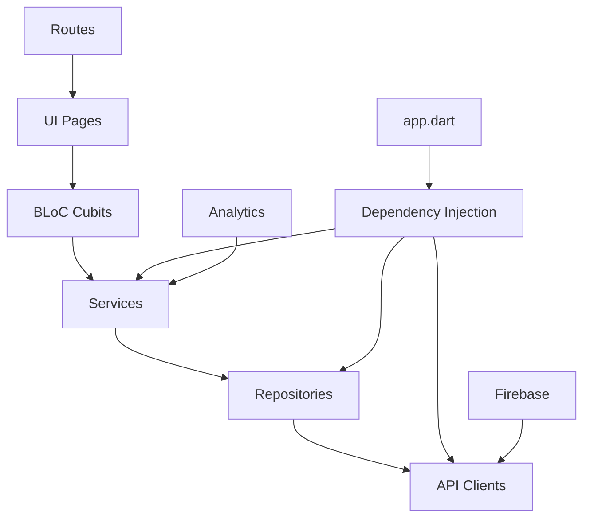

# 차란 Flutter 앱 - 프로젝트 개요 및 아키텍처 분석

## 📊 프로젝트 개요
- **프로젝트명**: Charan Flutter App (Ver.2)
- **기술 스택**: Flutter, BLoC, Clean Architecture, Firebase
- **분석일**: 2025-09-05
- **분석 목적**: 대규모 이커머스 앱의 Flutter 아키텍처 분석 및 블로그 글 작성 준비

## 🏗️ 아키텍처 분석

### 폴더 구조
```
lib/
├── app.dart                    # 의존성 주입 및 앱 설정
├── cubits/                     # BLoC 상태 관리
│   ├── auth/                   # 인증 관련 상태
│   ├── cart/                   # 장바구니 상태  
│   ├── route/                  # 라우팅 상태
│   └── ...
├── pages/                      # UI 페이지들
├── repositories/               # 데이터 레이어
│   ├── auth/
│   ├── cart/
│   └── ...
├── routes/                     # Auto Route 기반 라우팅
├── services/                   # 비즈니스 로직 서비스
│   ├── auth_service.dart
│   ├── cart_service.dart
│   └── ...
├── shared/                     # 공통 컴포넌트
└── main_[flavor].dart         # 환경별 엔트리 포인트
```

### 아키텍처 패턴
- **패턴**: Clean Architecture + BLoC Pattern
- **특징**: 
  - 계층별 명확한 분리 (UI - BLoC - Service - Repository)
  - 멀티 환경 지원 (dev, test, staging, alpha, prod)
  - 의존성 주입을 통한 느슨한 결합
- **장점**: 
  - 테스트 가능한 구조
  - 확장성과 유지보수성
  - 비즈니스 로직과 UI 분리
- **단점**: 
  - 초기 설정 복잡도
  - 파일 수 증가

### 의존성 관계


## 🔍 핵심 구현 분석

### 1. 멀티 환경 빌드 시스템
**파일 위치**: `main_*.dart`, `firebase_options_*.dart`

**핵심 코드**:
```dart
// main_prod.dart
void main() => entryPoint(Config.prod);

// main_dev.dart  
void main() => entryPoint(Config.dev);

void entryPoint(Config config) async {
  WidgetsFlutterBinding.ensureInitialized();
  
  // Firebase 환경별 초기화
  await Firebase.initializeApp(
    options: config.firebaseOptions,
  );
  
  runApp(App(config: config));
}
```

**분석**:
- **목적**: 개발/테스트/운영 환경 분리
- **구현 방식**: 각 환경별 엔트리 포인트와 Firebase 설정 분리
- **특이사항**: FVM 사용으로 Flutter 버전 통일 관리
- **개선 가능한 부분**: 환경별 설정을 더 추상화할 수 있음

### 2. BLoC 기반 상태 관리
**파일 위치**: `cubits/auth/auth_cubit.dart`

**핵심 코드**:
```dart
class AuthCubit extends Cubit<AuthState> {
  AuthCubit({
    required this.authService,
    required this.userService,
  }) : super(const AuthState.initial());

  final AuthService authService;
  final UserService userService;

  Future<void> login({required String method}) async {
    try {
      emit(const AuthState.loading());
      
      final user = await authService.login(method: method);
      await userService.updateCurrentUser(user);
      
      emit(AuthState.authenticated(user));
    } catch (e) {
      emit(AuthState.error(e.toString()));
    }
  }
}
```

**분석**:
- **목적**: UI와 비즈니스 로직 분리, 예측 가능한 상태 관리
- **구현 방식**: Cubit을 이용한 단방향 데이터 플로우
- **특이사항**: Freezed를 활용한 불변 상태 객체
- **개선 가능한 부분**: 에러 상태를 더 세분화할 수 있음

## 📈 성능 관련 코드

### 최적화 기법
1. **Repository 패턴을 통한 캐싱**
   - 위치: `repositories/reactive_repository.dart`
   - 효과: 불필요한 API 호출 줄임
   - 트레이드오프: 메모리 사용량 증가

2. **Lazy Loading 및 Pagination**
   - 위치: `pages/` 내 각 리스트 페이지
   - 효과: 초기 로딩 속도 향상
   - 트레이드오프: 복잡한 상태 관리 필요

## 🔐 보안 관련 코드

### 인증/인가
- **구현 위치**: `services/auth_service.dart`, `repositories/auth/`
- **방식**: JWT 토큰 기반 인증, Secure Storage 활용
- **보안 수준**: 토큰 암호화 저장, 자동 갱신

### 데이터 보호
- **암호화**: Flutter Secure Storage로 민감 데이터 보호
- **검증**: Firebase Analytics, Sentry를 통한 이상 행동 추적
- **로깅**: 개발/운영 환경별 로깅 레벨 분리

## 🧪 테스트 코드 분석

### 테스트 커버리지
- **단위 테스트**: Cubit과 Service 위주로 구성
- **통합 테스트**: Repository와 API 클라이언트 테스트
- **Widget 테스트**: Widgetbook을 활용한 컴포넌트 테스트

### 주요 테스트 케이스
```dart
void main() {
  group('AuthCubit', () {
    late AuthCubit authCubit;
    late MockAuthService mockAuthService;

    setUp(() {
      mockAuthService = MockAuthService();
      authCubit = AuthCubit(authService: mockAuthService);
    });

    test('should emit authenticated state on successful login', () async {
      // Given
      when(() => mockAuthService.login(method: any()))
          .thenAnswer((_) async => testUser);

      // When
      await authCubit.login(method: 'kakao');

      // Then
      expect(authCubit.state, isA<AuthStateAuthenticated>());
    });
  });
}
```

## 🐛 잠재적 문제점

### Code Smell
1. **거대한 app.dart 파일**
   - 위치: `lib/app.dart`
   - 문제: 의존성 주입이 한 곳에 집중됨
   - 해결 방안: DI Container 패턴 도입

2. **중복된 에러 처리 로직**
   - 위치: 각 Cubit 파일들
   - 문제: 동일한 try-catch 패턴 반복
   - 해결 방안: 공통 에러 핸들링 mixin 생성

### 기술 부채
- **Flutter 버전 업그레이드 필요**: 최신 성능 최적화 기능 활용
- **코드 생성 파일 관리**: .freezed, .g.dart 파일들의 버전 관리 전략 필요

## 🚀 개선 제안

### 단기 개선안 (1-2주)
- [ ] 공통 에러 핸들링 로직 추상화
- [ ] 중복 코드 제거 및 리팩터링

### 중기 개선안 (1-2개월)
- [ ] DI Container 도입으로 의존성 관리 개선
- [ ] 테스트 커버리지 확대

### 장기 개선안 (3개월+)
- [ ] Flutter 최신 버전 마이그레이션
- [ ] 마이크로 프론트엔드 아키텍처 검토

## 💡 인사이트 및 배운 점

### 좋은 패턴들
1. **환경별 빌드 분리**
   - 설명: 각 환경마다 독립적인 Firebase 프로젝트와 설정
   - 적용 가능한 곳: 모든 Flutter 프로젝트

2. **Reactive Repository 패턴**
   - 설명: Stream 기반 실시간 데이터 업데이트
   - 적용 가능한 곳: 실시간성이 중요한 앱

### 피해야 할 패턴들
1. **God Object로서의 app.dart**
   - 문제점: 모든 의존성이 한 곳에 집중
   - 대안: DI Container 패턴 활용

## 🔗 관련 문서
- [[Flutter Clean Architecture 구현 가이드]]
- [[BLoC 패턴 실전 적용]]
- [[멀티 환경 빌드 시스템]]

## 📝 블로그 글 아이디어
- [ ] Flutter Clean Architecture + BLoC 패턴 실전 적용기
- [ ] Flutter 멀티 환경 빌드 시스템 구축하기
- [ ] 대규모 Flutter 앱의 상태 관리 전략

---
**Tags**: #code-analysis #charan-flutter #flutter #clean-architecture #bloc
**Next Review**: 2025-09-12