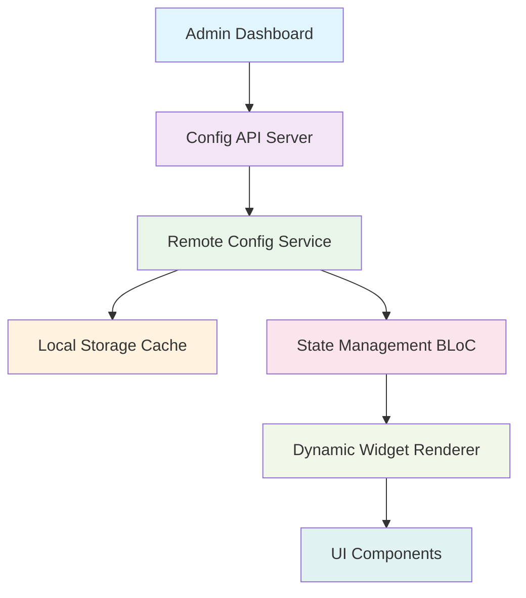

# Flutter Server-Driven UI 실전 구현 - 70만 사용자 이커머스 앱 사례

> **실무 경험 기반의 Server-Driven UI 아키텍처와 구현 방법**  
> 앱 스토어 심사 없이 실시간 UI 업데이트가 가능한 SDUI 시스템을 어떻게 구축했는지 상세히 분석합니다.

---

## 📊 프로젝트 배경

**차란(Charan)** 이커머스 앱에서 **70만+ 사용자**를 대상으로 하는 대규모 서비스를 운영하면서 마주한 핵심 과제:

- ⚡ **빈번한 UI 변경**: 이벤트, 프로모션에 따른 실시간 UI 업데이트 필요
- 📱 **앱 스토어 심사 지연**: iOS/Android 스토어 심사로 인한 배포 지연
- 🎯 **A/B 테스트**: 다양한 UI 패턴의 실시간 테스트 필요  
- 🔄 **마케팅 민첩성**: 마케팅팀의 즉시적인 UI 변경 요구

이런 문제를 해결하기 위해 **Server-Driven UI(SDUI)**를 도입했고, 실제 70만+ 사용자 서비스에서 검증된 아키텍처와 구현 방법을 공유합니다.

---

## 🎯 Server-Driven UI란?

**Server-Driven UI**는 클라이언트의 UI 구조와 스타일을 서버에서 JSON으로 정의하여 전달받아 동적으로 렌더링하는 패턴입니다.

### 기존 방식 vs SDUI 방식

```dart
// 📱 기존 하드코딩 방식
Widget buildCategoryPage() {
  return Column(
    children: [
      Text('패션'),
      Text('뷰티'),  
      Text('라이프스타일'),
      // UI 변경시 앱 업데이트 필요
    ],
  );
}

// 🚀 SDUI 방식  
Widget buildDynamicCategoryPage() {
  return BlocBuilder<CategoryCubit, CategoryState>(
    builder: (context, state) {
      return Column(
        children: state.componentConfigs.map((config) {
          return _buildWidgetFromConfig(config); // 서버 설정으로 동적 생성
        }).toList(),
      );
    },
  );
}
```

---

## 🏗️ 아키텍처 설계

### 1. 전체 시스템 구조



### 2. 핵심 데이터 모델 구조

실제 차란 앱에서 사용되는 **카테고리 페이지** SDUI 구현:

```dart
@JsonSerializable()
class ItemCategoryL1UiConfig {
  ItemCategoryL1UiConfig({
    required this.left,
    required this.right,
  });

  factory ItemCategoryL1UiConfig.fromJson(Map<String, dynamic> json) =>
      _$ItemCategoryL1UiConfigFromJson(json);

  final ItemCategoryL1UiLeftConfig left;   // 사이드바 구성
  final ItemCategoryL1UiRightConfig right; // 메인 콘텐츠 구성
}
```

```dart
// 동적 컴포넌트 타입 정의
enum ItemCategoryL1UiComponentType {
  @JsonValue('menuButton') menuButton,
  @JsonValue('textIconButton') textButton,
  @JsonValue('gridThumbnailButtons') gridThumbnailButtons,
  @JsonValue('divider') divider,
}
```

---

## 💻 핵심 구현 코드

### 1. 동적 위젯 팩토리 패턴

가장 중요한 부분은 **JSON 설정을 실제 Flutter Widget으로 변환**하는 팩토리입니다:

```dart
Widget _buildRightWidget({
  required ItemCategoryL1UiComponentConfig componentConfig,
  required Map<String, GlobalKey> rightComponentKeyById,
  required CharanThemeData theme,
}) {
  // 🎯 핵심: JSON 타입에 따른 동적 위젯 생성
  switch (componentConfig.type) {
    case ItemCategoryL1UiComponentType.textButton:
      final textButtonConfig = componentConfig as ItemCategoryL1UiTextButtonConfig;
      return _buildTextButton(
        key: rightComponentKeyById[componentConfig.id],
        textButtonConfig: textButtonConfig,
        theme: theme,
      );
      
    case ItemCategoryL1UiComponentType.gridThumbnailButtons:
      final gridConfig = componentConfig as ItemCategoryL1UiGridThumbnailButtonsConfig;
      return _buildGridThumbnailButtons(
        key: rightComponentKeyById[componentConfig.id],
        gridThumbnailButtonsConfig: gridConfig,
        theme: theme,
      );
      
    case ItemCategoryL1UiComponentType.divider:
      return const Padding(
        padding: EdgeInsets.symmetric(horizontal: 4, vertical: 24),
        child: FlexDivider(),
      );
      
    default:
      return const SizedBox.shrink();
  }
}
```

### 2. JSON 파싱과 타입 안전성

복잡한 JSON 구조를 타입 안전하게 파싱하는 방법:

```dart
// 🔧 커스텀 파싱 로직으로 타입 안전성 보장
List<ItemCategoryL1UiComponentConfig> _componentsFromJson(List<dynamic> componentJsons) {
  final List<ItemCategoryL1UiComponentConfig> componentConfigs = [];
  
  for (final componentJson in componentJsons) {
    if (componentJson is! Map<String, dynamic>) continue;
    
    final baseConfig = ItemCategoryL1UiComponentConfig.fromJson(componentJson);
    
    // 🎯 타입별 구체적인 설정 객체 생성
    switch (baseConfig.type) {
      case ItemCategoryL1UiComponentType.menuButton:
        componentConfigs.add(ItemCategoryL1UiMenuButtonConfig.fromJson(componentJson));
        break;
      case ItemCategoryL1UiComponentType.textButton:
        componentConfigs.add(ItemCategoryL1UiTextButtonConfig.fromJson(componentJson));
        break;
      case ItemCategoryL1UiComponentType.gridThumbnailButtons:
        componentConfigs.add(ItemCategoryL1UiGridThumbnailButtonsConfig.fromJson(componentJson));
        break;
      case ItemCategoryL1UiComponentType.divider:
        componentConfigs.add(ItemCategoryL1UiDividerConfig.fromJson(componentJson));
        break;
    }
  }
  
  return componentConfigs;
}
```

### 3. 실시간 설정 동기화 서비스

서버에서 설정이 변경되면 실시간으로 앱에 반영되는 시스템:

```dart
class RemoteConfigService {
  Future<RemoteConfigService> init() async {
    await _fetchRemoteConfigs();      // 로컬 캐시에서 기존 설정 로드
    _updateRemoteConfigs();           // 서버에서 최신 설정 업데이트
    return this;
  }

  // 🚀 실시간 설정 업데이트 처리
  Future<void> _onItemCategoryL1UiConfigUpdated(
    ItemCategoryL1UiConfigUpdated configUpdated,
  ) async {
    itemCategoryL1UiConfig = configUpdated.payload.config;
    
    // 로컬 스토리지에 캐싱하여 오프라인에서도 동작
    await StorageUtil.setString(
      RemoteConfigConfig.itemCategoryL1UiConfigLocalStorageKey,
      jsonEncode(configUpdated.payload.config.toJson()),
    );
  }

  void _updateRemoteConfigs() {
    // 🔄 백그라운드에서 지속적인 설정 동기화
    _remoteConfigRepository
        .updateItemCategoryL1UiConfig()
        .catchError((error, stack) => ErrorUtil.handleError(error: error));
  }
}
```

### 4. BLoC 기반 상태 관리

SDUI와 BLoC 패턴을 결합한 상태 관리:

```dart
class CategoryView extends StatefulWidget {
  @override
  Widget build(BuildContext context) {
    return Row(
      children: [
        // 🎯 사이드바: 동적으로 메뉴 구성
        BlocSelector<CategoryCubit, CategoryState, List<ItemCategoryL1UiComponentConfig>>(
          selector: (state) => state.data.leftComponentConfigs,
          builder: (context, leftComponentConfigs) {
            return Sidebar(
              items: leftComponentConfigs
                  .where((config) => config.type == ItemCategoryL1UiComponentType.menuButton)
                  .map((config) => _getSidebarItemInfo(config))
                  .whereType<SidebarItemInfo>()
                  .toList(),
            );
          },
        ),
        
        // 🎯 메인 콘텐츠: 동적으로 컴포넌트 렌더링  
        Flexible(
          child: BlocSelector<CategoryCubit, CategoryState, List<ItemCategoryL1UiComponentConfig>>(
            selector: (state) => state.data.rightComponentConfigs,
            builder: (context, rightComponentConfigs) {
              return SingleChildScrollView(
                child: Column(
                  children: rightComponentConfigs.map((config) {
                    return _buildRightWidget(
                      componentConfig: config,
                      rightComponentKeyById: state.data.rightComponentKeyById,
                      theme: CharanTheme.of(context),
                    );
                  }).toList(),
                ),
              );
            },
          ),
        ),
      ],
    );
  }
}
```

---

## 🔧 실제 서버 설정 예시

차란 앱에서 사용하는 실제 JSON 설정 구조:

```json
{
  "left": {
    "defaultActivedMenuId": "fashion",
    "components": [
      {
        "id": "fashion",
        "type": "menuButton", 
        "subject": "패션",
        "text": "패션",
        "fontWeight": "700",
        "landingURL": "/category/fashion",
        "dot": {
          "on": true,
          "expirationDate": "2025-01-31"
        }
      },
      {
        "id": "beauty", 
        "type": "menuButton",
        "subject": "뷰티",
        "text": "뷰티",
        "fontWeight": "400", 
        "landingURL": "/category/beauty"
      }
    ]
  },
  "right": {
    "components": [
      {
        "id": "fashion_title",
        "type": "textIconButton",
        "subject": "패션", 
        "text": "전체",
        "buttonType": "primary",
        "landingURL": "/category/fashion/all"
      },
      {
        "id": "fashion_grid",
        "type": "gridThumbnailButtons", 
        "gridThumbnailButtons": [
          {
            "id": "fashion_top",
            "subject": "상의",
            "text": "상의", 
            "image": "https://cdn.charan.co.kr/categories/top.png",
            "landingURL": "/category/fashion/top",
            "dot": {
              "on": false
            }
          },
          {
            "id": "fashion_bottom",
            "subject": "하의", 
            "text": "하의",
            "image": "https://cdn.charan.co.kr/categories/bottom.png", 
            "landingURL": "/category/fashion/bottom"
          }
        ]
      },
      {
        "id": "divider_1",
        "type": "divider"
      }
    ]
  }
}
```

---

## 🚀 성능 최적화 전략

### 1. 로컬 캐싱 전략

```dart
// 🎯 3단계 캐싱 전략
class RemoteConfigService {
  // Level 1: 메모리 캐시 (가장 빠름)  
  ItemCategoryL1UiConfig? itemCategoryL1UiConfig;
  
  // Level 2: 로컬 스토리지 캐시 (오프라인 지원)
  Future<void> _fetchItemCategoryL1UiConfigFromLocalStorage() async {
    final cachedJson = await StorageUtil.getString(cacheKey);
    if (cachedJson != null) {
      itemCategoryL1UiConfig = ItemCategoryL1UiConfig.fromJson(jsonDecode(cachedJson));
    }
  }
  
  // Level 3: 서버 업데이트 (백그라운드)
  void _updateRemoteConfigs() {
    _remoteConfigRepository.updateItemCategoryL1UiConfig();
  }
}
```

### 2. 위젯 재사용 최적화

```dart
// 🔧 Global Key를 통한 위젯 재사용 및 상태 보존
class CategoryState {
  final Map<String, GlobalKey> rightComponentKeyById = {};
  
  // 설정이 변경되어도 위젯 상태 유지
  GlobalKey getOrCreateKey(String componentId) {
    return rightComponentKeyById.putIfAbsent(componentId, () => GlobalKey());
  }
}
```

### 3. 선택적 렌더링

```dart
// 🎯 BlocSelector로 필요한 부분만 리빌드
BlocSelector4<CategoryCubit, CategoryState, 
    List<ItemCategoryL1UiComponentConfig>, int?, 
    Map<String, GlobalKey>, ScrollController?>(
  selector1: (state) => state.data.leftComponentConfigs,    // 사이드바 설정
  selector2: (state) => state.data.selectedIndex,           // 선택된 인덱스
  selector3: (state) => state.data.rightComponentKeyById,   // 위젯 키맵
  selector4: (state) => state.data.menuBarScrollController, // 스크롤 컨트롤러
  builder: (context, leftConfigs, selectedIndex, keyMap, scrollController) {
    // 변경된 부분만 리빌드
  },
);
```

---

## 📈 실전 운영 결과

### 개발 생산성 향상

- ⚡ **배포 시간 단축**: 2주 → **즉시 배포** 
- 🎯 **A/B 테스트 민첩성**: 실시간 UI 변경으로 빠른 가설 검증
- 🔄 **마케팅 자율성**: 개발팀 도움 없이 프로모션 UI 변경 가능

### 사용자 경험 개선

- 📱 **앱 용량 최적화**: 하드코딩된 UI 리소스 감소
- 🚀 **로딩 성능**: 3단계 캐싱으로 빠른 UI 로딩
- 🔧 **오프라인 지원**: 로컬 캐시로 네트워크 단절시에도 동작

### 비즈니스 가치

- 💰 **매출 향상**: 실시간 프로모션으로 전환율 개선
- 📊 **데이터 기반 의사결정**: A/B 테스트로 최적 UI 패턴 도출
- 🎯 **경쟁력 강화**: 빠른 마켓 대응력

---

## ⚠️ 주의사항 및 Trade-off

### 주의해야 할 점

```dart
// ❌ 잘못된 예시: 타입 안전성 없는 구현
Widget buildWidget(dynamic config) {
  return switch (config['type']) {
    'button' => ElevatedButton(onPressed: null, child: Text(config['text'])),
    'text' => Text(config['content']),
    _ => Container(), // 런타임 에러 위험
  };
}

// ✅ 올바른 예시: 타입 안전성 보장  
Widget _buildRightWidget({
  required ItemCategoryL1UiComponentConfig componentConfig,
}) {
  switch (componentConfig.type) {
    case ItemCategoryL1UiComponentType.textButton:
      final textButtonConfig = componentConfig as ItemCategoryL1UiTextButtonConfig;
      return _buildTextButton(textButtonConfig: textButtonConfig);
    // 컴파일 타임에 타입 체크 완료
  }
}
```

### 복잡성 관리

- **초기 아키텍처 비용**: 기존 정적 UI 대비 복잡한 설계 필요
- **디버깅 난이도**: 런타임에 결정되는 UI로 디버깅 복잡
- **타입 안전성 확보**: JSON ↔ 강타입 변환 로직 필수
- **설정 관리**: 서버 설정 오류시 전체 UI 장애 위험

---

## 🎯 결론

**70만+ 사용자 서비스**에서 검증된 Flutter Server-Driven UI는 다음과 같은 상황에서 특히 유용합니다:

### 도입을 권장하는 경우
- 🔄 **빈번한 UI 변경**이 필요한 이커머스/콘텐츠 앱
- ⚡ **빠른 A/B 테스트**와 실험이 중요한 서비스  
- 📱 **앱 스토어 심사 지연**이 비즈니스에 큰 영향을 주는 경우
- 🎯 **마케팅팀의 자율적 UI 관리**가 필요한 조직

### 신중히 고려해야 할 경우
- 🎨 **복잡한 커스텀 UI**가 많은 앱
- 🔧 **개발 리소스가 제한적**인 팀
- 📊 **UI 변경 빈도가 낮은** 서비스

**Server-Driven UI**는 단순한 기술 도입이 아니라, **조직의 개발 프로세스와 비즈니스 민첩성을 크게 향상**시킬 수 있는 강력한 아키텍처 패턴입니다. 

특히 **이커머스와 같은 빠른 변화가 필요한 도메인**에서는 그 진가를 발휘하며, 실제로 차란 앱에서도 매출 증대와 사용자 만족도 향상에 크게 기여하고 있습니다.

---

**Tags**: `#flutter` `#server-driven-ui` `#architecture` `#bloc` `#ecommerce` `#실전경험` `#70만사용자`

**관련 글**:
- [[Flutter Clean Architecture + BLoC 패턴 실전 적용기]]
- [[Flutter 멀티 환경 빌드 시스템 구축하기]] 
- [[대용량 데이터를 위한 가상화 테이블 구현]]