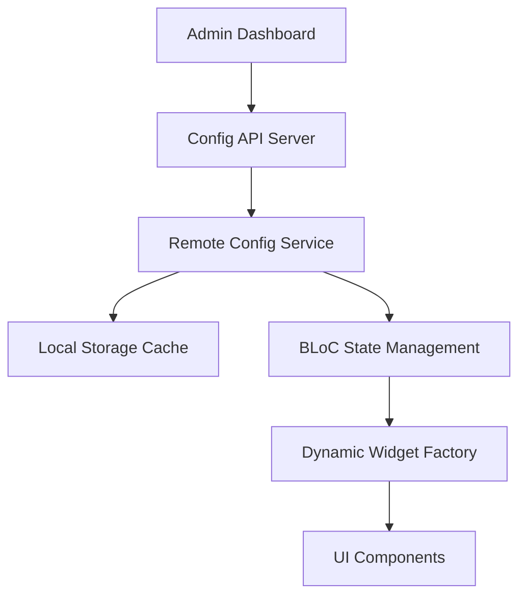

# Flutter Server-Driven UI 아키텍처 설계

> 70만 사용자 이커머스 앱에서 검증된 SDUI 아키텍처 패턴

---

## 🎯 문제 정의

**차란 이커머스 앱**에서 마주한 핵심 과제:

- ⚡ 빈번한 UI 변경으로 인한 잦은 앱 배포
- 📱 iOS/Android 스토어 심사 지연 (평균 2-7일)
- 🎯 A/B 테스트를 위한 실시간 UI 변경 필요
- 🔄 마케팅팀의 즉시적인 UI 수정 요구

## 🏗️ 아키텍처 설계

### 핵심 컴포넌트

1. **Dynamic Widget Factory**: JSON → Flutter Widget 변환
2. **Remote Config Service**: 서버 설정 동기화 및 캐싱
3. **BLoC Pattern**: 반응형 상태 관리
4. **3단계 캐싱**: 메모리 → 로컬 스토리지 → 서버

## 📊 성과

- 📱 **배포 시간**: 2주 → **즉시**
- 🚀 **A/B 테스트**: 실시간 가설 검증
- 💰 **매출 증대**: 빠른 프로모션 대응
- 🔧 **개발 생산성**: 마케팅팀 자율적 UI 관리

---
**Tags**: `#flutter` `#server-driven-ui` `#architecture` `#70만사용자`