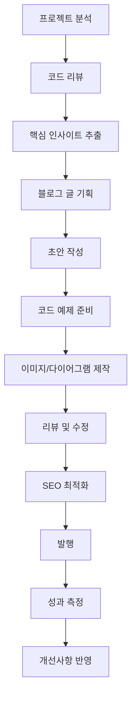

# 📝 Blog Post Pipeline MOC

> 블로그 글 작성 파이프라인의 전체적인 흐름을 관리하는 Map of Content

## 🚀 현재 진행 상황

### 📊 대시보드
```dataview
TABLE 
  file.name as "글 제목",
  status as "상태", 
  tech-stack as "기술",
  file.ctime as "생성일"
FROM "300-Blog-Posts"
WHERE contains(tags, "#in-progress") OR contains(tags, "#ready-to-publish")
SORT file.ctime DESC
```

### 📈 완료된 글들
```dataview
TABLE 
  file.name as "제목",
  publish-date as "발행일",
  views as "조회수",
  rating as "평점"
FROM "300-Blog-Posts/Published"
SORT publish-date DESC
LIMIT 10
```

## 🎯 블로그 글 시리즈 계획

### Phase 1: 기반 기술 (4개 글) 🟡
- [ ] [[Flutter Clean Architecture + BLoC 패턴 실전 적용기]] #flutter #architecture
- [ ] [[Flutter 멀티 환경 빌드 시스템 구축하기]] #flutter #devops  
- [ ] [[React SPA 아키텍처와 Recoil + React Query 조합]] #react #state-management
- [ ] [[대용량 데이터를 위한 가상화 테이블 구현]] #react #performance

### Phase 2: 성능 최적화 (3개 글) 🔵  
- [ ] [[Server-Driven UI로 배포 없는 실시간 업데이트 구현]] #server-driven-ui #flutter
- [ ] [[Flutter WebView-Native 하이브리드 아키텍처 설계]] #flutter #hybrid
- [ ] [[React 번들 최적화와 Code Splitting 전략]] #react #performance

### Phase 3: 개발자 도구 (3개 글) 🟢
- [ ] [[Flutter Design System + Widgetbook 구축기]] #design-system #flutter
- [ ] [[Codemagic + Shorebird로 심사 없는 앱 배포 파이프라인]] #ci-cd #flutter
- [ ] [[멀티 플랫폼 Docker 기반 배포 시스템]] #docker #devops

### Phase 4: 도메인 지식 (2개 글) 🟣
- [ ] [[Go 기반 WMS 백엔드 아키텍처 설계]] #golang #backend
- [ ] [[이커머스 도메인 복잡성 해결 전략]] #domain-driven-design #ecommerce

## 📊 글 상태 트래킹

### 🔴 아이디어 단계 (`#idea`)
```dataview
LIST
FROM "300-Blog-Posts/Ideas"
WHERE contains(tags, "#idea")
```

### 🟡 작성 중 (`#in-progress`)  
```dataview
TABLE progress as "진행률", deadline as "마감일"
FROM "300-Blog-Posts/In-Progress"  
WHERE contains(tags, "#in-progress")
```

### 🟢 발행 준비 (`#ready-to-publish`)
```dataview
LIST
FROM "300-Blog-Posts"
WHERE contains(tags, "#ready-to-publish")
```

### ⚫ 발행 완료 (`#published`)
```dataview
TABLE publish-date as "발행일", platform as "플랫폼", views as "조회수"
FROM "300-Blog-Posts/Published"
WHERE contains(tags, "#published")
SORT publish-date DESC
```

## 🎨 콘텐츠 타입별 분류

### 📖 튜토리얼 글
- [[Flutter Clean Architecture 구현 가이드]]
- [[React 성능 최적화 완벽 가이드]]

### 🔍 분석 글  
- [[차란 앱 아키텍처 분석]]
- [[WMS 시스템 성능 분석]]

### 💡 경험담
- [[MVP에서 70만 사용자까지 성장 과정]]
- [[멀티플랫폼 개발팀의 협업 방식]]

### 🛠️ 도구 리뷰
- [[Widgetbook vs Storybook 비교]]
- [[Flutter 상태관리 라이브러리 비교]]

## 🏷️ 태그 활용 전략

### 기술 태그
- `#flutter` `#react` `#golang`
- `#architecture` `#performance` `#devops`

### 상태 태그
- `#idea` `#in-progress` `#review` `#ready-to-publish` `#published`

### 난이도 태그  
- `#beginner` `#intermediate` `#advanced`

### 시리즈 태그
- `#charan-series` `#architecture-series` `#performance-series`

## 📅 발행 스케줄

### 주간 목표
- **월요일**: 코드 분석 및 자료 수집
- **화요일-수요일**: 글 작성 및 코드 예제 준비  
- **목요일**: 리뷰 및 수정
- **금요일**: 최종 검토 및 발행

### 월간 목표
- **1-2주차**: Phase 1 글 1개 완료
- **3-4주차**: Phase 2 글 1개 완료

## 🎯 KPI 및 목표

### 정량적 목표
- **월 발행**: 2-3개 글
- **평균 조회수**: 1,000+ 
- **평균 읽기 시간**: 5분+
- **댓글 참여율**: 5%+

### 정성적 목표  
- **기술적 깊이**: 실제 프로젝트 기반 인사이트
- **실용성**: 바로 적용 가능한 코드와 가이드
- **차별화**: 대규모 서비스 경험 기반 노하우

## 🔄 워크플로우



## 📚 참고 자료 모음
- [[기술 블로그 작성 가이드]]
- [[SEO 최적화 체크리스트]] 
- [[코드 예제 작성 규칙]]
- [[이미지 제작 가이드라인]]

---
**Tags**: #moc #blog-pipeline #planning
**Last Updated**: {{date}}